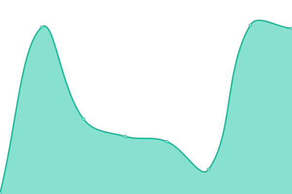
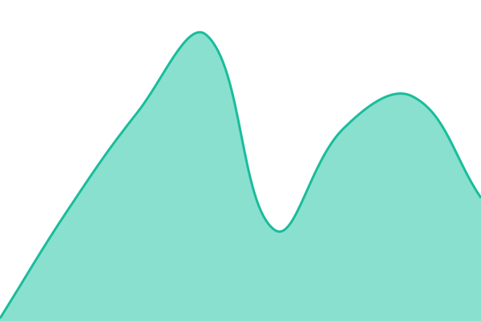
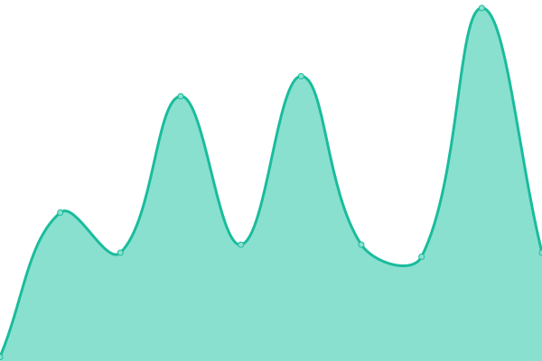

# [📈 Live Status](https://gil@kobra.red.github.io/uptime): <!--live status--> **🟩 All systems operational**

This repository contains the open-source uptime monitor and status page for [gil@kobra.red](https://gil@kobra.red.github.io/uptime), powered by [Upptime](https://github.com/upptime/upptime).

With [Upptime](https://upptime.js.org), you can get your own unlimited and free uptime monitor and status page, powered entirely by a GitHub repository. We use [Issues](https://github.com/gil@kobra.red/uptime/issues) as incident reports, [Actions](https://github.com/gil@kobra.red/uptime/actions) as uptime monitors, and [Pages](https://gil@kobra.red.github.io/uptime) for the status page.

<!--start: status pages-->
<!-- This summary is generated by Upptime (https://github.com/upptime/upptime) -->
<!-- Do not edit this manually, your changes will be overwritten -->
<!-- prettier-ignore -->
| URL | Status | History | Response Time | Uptime |
| --- | ------ | ------- | ------------- | ------ |
|  [Admin](https://eladmin.kobra.red) | 🟩 Up | [admin.yml](https://github.com/gilkobra/uptime/commits/HEAD/history/admin.yml) | 

 233ms
     
 | 

<a href="https://gilkobra.github.io/uptime/history/admin">39.04%</a>
    

|  [AppsServices (lean-services)](https://apps.kobra.red/s1/lean-services/) | 🟩 Up | [apps-services-lean-services.yml](https://github.com/gilkobra/uptime/commits/HEAD/history/apps-services-lean-services.yml) | 

 212ms
     
 | 

<a href="https://gilkobra.github.io/uptime/history/apps-services-lean-services">39.04%</a>
    

|  [AppsServices (visitas)](https://apps.kobra.red/s1/visitas/) | 🟩 Up | [apps-services-visitas.yml](https://github.com/gilkobra/uptime/commits/HEAD/history/apps-services-visitas.yml) | 

 22ms
     
 | 

<a href="https://gilkobra.github.io/uptime/history/apps-services-visitas">39.04%</a>
    

|  [AppsServices (storage)](https://apps.kobra.red/s1/storage/) | 🟩 Up | [apps-services-storage.yml](https://github.com/gilkobra/uptime/commits/HEAD/history/apps-services-storage.yml) | 

 21ms
     
 | 

<a href="https://gilkobra.github.io/uptime/history/apps-services-storage">39.04%</a>
    

|  [AppsServices (kobra-saldos)](https://apps.kobra.red/s1/kobra-saldos/) | 🟩 Up | [apps-services-kobra-saldos.yml](https://github.com/gilkobra/uptime/commits/HEAD/history/apps-services-kobra-saldos.yml) | 

 22ms
     
 | 

<a href="https://gilkobra.github.io/uptime/history/apps-services-kobra-saldos">39.04%</a>
    

|  [AppsServices (gestores)](https://apps.kobra.red/s1/gestores/) | 🟩 Up | [apps-services-gestores.yml](https://github.com/gilkobra/uptime/commits/HEAD/history/apps-services-gestores.yml) | 

 22ms
     
 | 

<a href="https://gilkobra.github.io/uptime/history/apps-services-gestores">39.04%</a>
    

<!--end: status pages-->

[**Visit our status website →**](https://gil@kobra.red.github.io/uptime)

## 📄 License

- Powered by: [Upptime](https://github.com/upptime/upptime)
- Code: [MIT](./LICENSE) © [Anand Chowdhary](https://anandchowdhary.com), supported by [Pabio](https://pabio.com)
- Data in the `./history` directory: [Open Database License](https://opendatacommons.org/licenses/odbl/1-0/)
