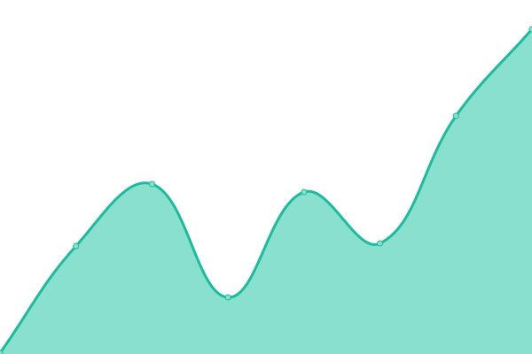
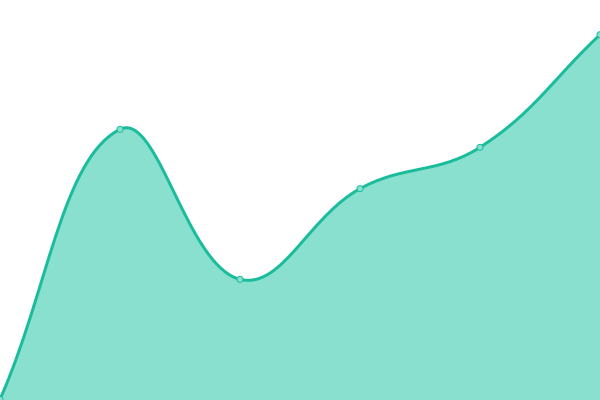
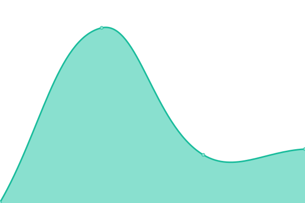

# [📈 Live Status](https://gil@kobra.red.github.io/uptime): <!--live status--> **🟧 Partial outage**

This repository contains the open-source uptime monitor and status page for [gil@kobra.red](https://gil@kobra.red.github.io/uptime), powered by [Upptime](https://github.com/upptime/upptime).

With [Upptime](https://upptime.js.org), you can get your own unlimited and free uptime monitor and status page, powered entirely by a GitHub repository. We use [Issues](https://github.com/gil@kobra.red/uptime/issues) as incident reports, [Actions](https://github.com/gil@kobra.red/uptime/actions) as uptime monitors, and [Pages](https://gil@kobra.red.github.io/uptime) for the status page.

<!--start: status pages-->
<!-- This summary is generated by Upptime (https://github.com/upptime/upptime) -->
<!-- Do not edit this manually, your changes will be overwritten -->
<!-- prettier-ignore -->
| URL | Status | History | Response Time | Uptime |
| --- | ------ | ------- | ------------- | ------ |
|  [App Services](https://apps.kobra.red/s1/visitas/) | 🟩 Up | [app-services.yml](https://github.com/gilkobra/uptime/commits/HEAD/history/app-services.yml) | 

 189ms
     
 | 

<a href="https://gilkobra.github.io/uptime/history/app-services">0.38%</a>
    

|  [App Services 2](https://apps.kobra.red/s1/lean-services/) | 🟩 Up | [app-services-2.yml](https://github.com/gilkobra/uptime/commits/HEAD/history/app-services-2.yml) | 

 27ms
     
 | 

<a href="https://gilkobra.github.io/uptime/history/app-services-2">0.68%</a>
    

|  [App Services 3](https://apps.kobra.red/s1/storage/) | 🟩 Up | [app-services-3.yml](https://github.com/gilkobra/uptime/commits/HEAD/history/app-services-3.yml) | 

 32ms
     
 | 

<a href="https://gilkobra.github.io/uptime/history/app-services-3">0.92%</a>
    

|  [App Services 4](https://apps.kobra.red) | 🟥 Down | [app-services-4.yml](https://github.com/gilkobra/uptime/commits/HEAD/history/app-services-4.yml) | 

 163ms
     
 | 

<a href="https://gilkobra.github.io/uptime/history/app-services-4">0.00%</a>
    

|  [App Services 5](https://visits.kobra.red) | 🟩 Up | [app-services-5.yml](https://github.com/gilkobra/uptime/commits/HEAD/history/app-services-5.yml) | 

 366ms
     
 | 

<a href="https://gilkobra.github.io/uptime/history/app-services-5">100.00%</a>
    

|  [App Services 6](https://google.com) | 🟩 Up | [app-services-6.yml](https://github.com/gilkobra/uptime/commits/HEAD/history/app-services-6.yml) | 

 187ms
     
 | 

<a href="https://gilkobra.github.io/uptime/history/app-services-6">100.00%</a>
    

|  [Admin](admin.kobra.red) | 🟩 Up | [admin.yml](https://github.com/gilkobra/uptime/commits/HEAD/history/admin.yml) | 

 375ms
     
 | 

<a href="https://gilkobra.github.io/uptime/history/admin">7.78%</a>
    

<!--end: status pages-->

[**Visit our status website →**](https://gil@kobra.red.github.io/uptime)

## 📄 License

- Powered by: [Upptime](https://github.com/upptime/upptime)
- Code: [MIT](./LICENSE) © [Anand Chowdhary](https://anandchowdhary.com), supported by [Pabio](https://pabio.com)
- Data in the `./history` directory: [Open Database License](https://opendatacommons.org/licenses/odbl/1-0/)
