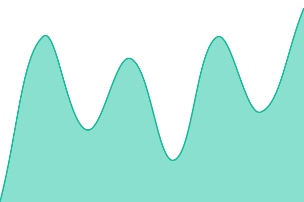
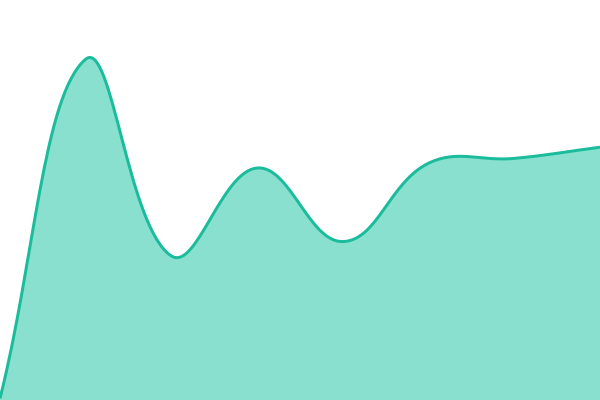

# [📈 Live Status](https://status.kobra.red): <!--live status--> **🟩 All systems operational**

This repository contains the open-source uptime monitor and status page for [gilverduzco](https://status.kobra.red), powered by [Upptime](https://github.com/upptime/upptime).

With [Upptime](https://upptime.js.org), you can get your own unlimited and free uptime monitor and status page, powered entirely by a GitHub repository. We use [Issues](https://github.com/gilkobra/uptime/issues) as incident reports, [Actions](https://github.com/gilkobra/uptime/actions) as uptime monitors, and [Pages](https://status.kobra.red) for the status page.

<!--start: status pages-->
<!-- This summary is generated by Upptime (https://github.com/upptime/upptime) -->
<!-- Do not edit this manually, your changes will be overwritten -->
<!-- prettier-ignore -->
| URL | Status | History | Response Time | Uptime |
| --- | ------ | ------- | ------------- | ------ |
|  [Sitio Público](https://kobra.red) | 🟩 Up | [sitio-publico.yml](https://github.com/gilkobra/uptime/commits/HEAD/history/sitio-publico.yml) | 

 748ms
     
 | 

<a href="https://status.kobra.red/history/sitio-publico">100.00%</a>
    

|  [Admin](https://admin.kobra.red) | 🟩 Up | [admin.yml](https://github.com/gilkobra/uptime/commits/HEAD/history/admin.yml) | 

 358ms
     
 | 

<a href="https://status.kobra.red/history/admin">100.00%</a>
    

|  [AppsServices (lservices)](https://apps.kobra.red/s1/lservices/) | 🟩 Up | [apps-services-lservices.yml](https://github.com/gilkobra/uptime/commits/HEAD/history/apps-services-lservices.yml) | 

 270ms
     
 | 

<a href="https://status.kobra.red/history/apps-services-lservices">100.00%</a>
    

|  [AppsServices (storage20)](https://apps.kobra.red/s1/storage20/health) | 🟩 Up | [apps-services-storage20.yml](https://github.com/gilkobra/uptime/commits/HEAD/history/apps-services-storage20.yml) | 

 113ms
     
 | 

<a href="https://status.kobra.red/history/apps-services-storage20">100.00%</a>
    

|  [AppsServices (kobra-saldos)](https://apps.kobra.red/s1/kobra-saldos/) | 🟩 Up | [apps-services-kobra-saldos.yml](https://github.com/gilkobra/uptime/commits/HEAD/history/apps-services-kobra-saldos.yml) | 

 196ms
     
 | 

<a href="https://status.kobra.red/history/apps-services-kobra-saldos">100.00%</a>
    

|  [AppsServices (pyv-services)](https://apps.kobra.red/s1/pyv-services/health) | 🟩 Up | [apps-services-pyv-services.yml](https://github.com/gilkobra/uptime/commits/HEAD/history/apps-services-pyv-services.yml) | 

 140ms
     
 | 

<a href="https://status.kobra.red/history/apps-services-pyv-services">100.00%</a>
    

<!--end: status pages-->

[**Visit our status website →**](https://status.kobra.red)

## 📄 License

- Powered by: [Upptime](https://github.com/upptime/upptime)
- Code: [MIT](./LICENSE) © [Anand Chowdhary](https://anandchowdhary.com), supported by [Pabio](https://pabio.com)
- Data in the `./history` directory: [Open Database License](https://opendatacommons.org/licenses/odbl/1-0/)
