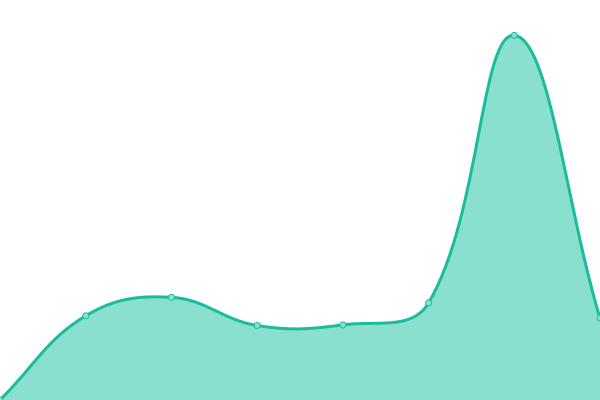
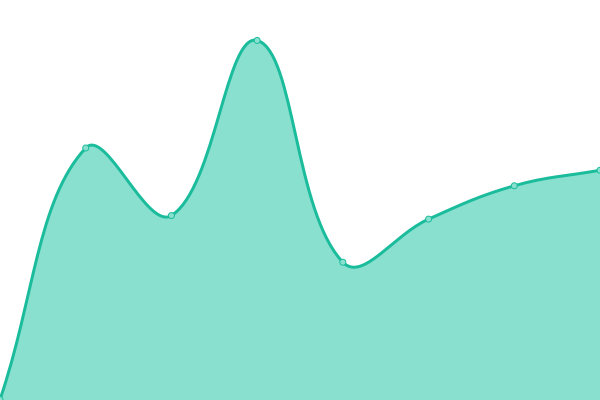
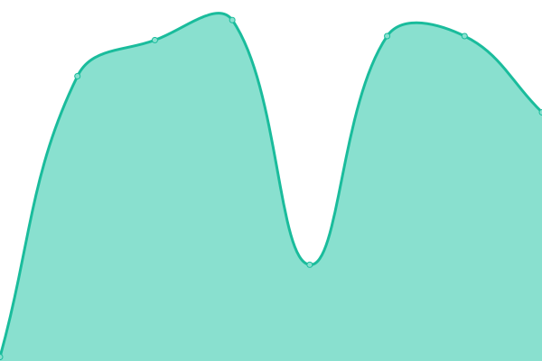

# [📈 Live Status](https://status.kobra.red): <!--live status--> **🟩 All systems operational**

This repository contains the open-source uptime monitor and status page for [gilverduzco](https://status.kobra.red), powered by [Upptime](https://github.com/upptime/upptime).

With [Upptime](https://upptime.js.org), you can get your own unlimited and free uptime monitor and status page, powered entirely by a GitHub repository. We use [Issues](https://github.com/gilkobra/uptime/issues) as incident reports, [Actions](https://github.com/gilkobra/uptime/actions) as uptime monitors, and [Pages](https://status.kobra.red) for the status page.

<!--start: status pages-->
<!-- This summary is generated by Upptime (https://github.com/upptime/upptime) -->
<!-- Do not edit this manually, your changes will be overwritten -->
<!-- prettier-ignore -->
| URL | Status | History | Response Time | Uptime |
| --- | ------ | ------- | ------------- | ------ |
|  [Sitio Público](https://kobra.red) | 🟩 Up | [sitio-publico.yml](https://github.com/gilkobra/uptime/commits/HEAD/history/sitio-publico.yml) | 

 945ms
     
 | 

<a href="https://status.kobra.red/history/sitio-publico">100.00%</a>
    

|  [Admin](https://admin.kobra.red) | 🟩 Up | [admin.yml](https://github.com/gilkobra/uptime/commits/HEAD/history/admin.yml) | 

 441ms
     
 | 

<a href="https://status.kobra.red/history/admin">100.00%</a>
    

|  [AppsServices (lean-services)](https://apps.kobra.red/s1/lean-services/) | 🟩 Up | [apps-services-lean-services.yml](https://github.com/gilkobra/uptime/commits/HEAD/history/apps-services-lean-services.yml) | 

 309ms
     
 | 

<a href="https://status.kobra.red/history/apps-services-lean-services">100.00%</a>
    

|  [AppsServices (visitas)](https://apps.kobra.red/s1/visitas/) | 🟩 Up | [apps-services-visitas.yml](https://github.com/gilkobra/uptime/commits/HEAD/history/apps-services-visitas.yml) | 

 121ms
     
 | 

<a href="https://status.kobra.red/history/apps-services-visitas">100.00%</a>
    

|  [AppsServices (storage)](https://apps.kobra.red/s1/storage/) | 🟩 Up | [apps-services-storage.yml](https://github.com/gilkobra/uptime/commits/HEAD/history/apps-services-storage.yml) | 

 59ms
     
 | 

<a href="https://status.kobra.red/history/apps-services-storage">100.00%</a>
    

|  [AppsServices (kobra-saldos)](https://apps.kobra.red/s1/kobra-saldos/) | 🟩 Up | [apps-services-kobra-saldos.yml](https://github.com/gilkobra/uptime/commits/HEAD/history/apps-services-kobra-saldos.yml) | 

 86ms
     
 | 

<a href="https://status.kobra.red/history/apps-services-kobra-saldos">100.00%</a>
    

<!--end: status pages-->

[**Visit our status website →**](https://status.kobra.red)

## 📄 License

- Powered by: [Upptime](https://github.com/upptime/upptime)
- Code: [MIT](./LICENSE) © [Anand Chowdhary](https://anandchowdhary.com), supported by [Pabio](https://pabio.com)
- Data in the `./history` directory: [Open Database License](https://opendatacommons.org/licenses/odbl/1-0/)
